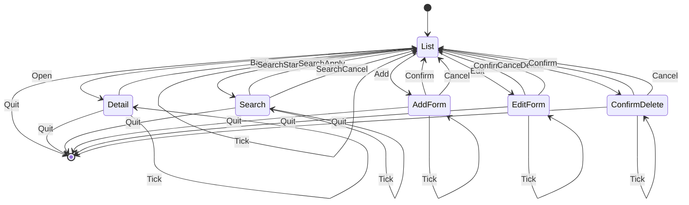

# TUI State Machine

This document describes the TUI state machine implied by `src/ui/tui/commands.rs` and `src/ui/tui/events.rs`. It is a minimal design that matches the current command set and keeps responsibilities clear.

Why this shape:
- The current `Command` enum already models navigation and modal actions, which map cleanly to a UI state machine.
- A single active `AppState` keeps rendering and event handling predictable (avoid "who owns focus" issues).
- Form-like states (`AddForm`, `EditForm`, `Search`) isolate text input handling from the list view.
- Confirm states (`ConfirmDelete`) let you reuse `Confirm/Cancel` semantics without making every action destructive.
- `Tick` is handled as a self-transition to support periodic refreshes without coupling to input handling.

Notes and gaps:
- The TUI loop is not implemented yet; once added, store `AppState` in a single struct and drive updates with `Command` values from `events::poll_command`.
- There is no explicit resize handling today; if/when needed, add a `Resize` command and a self-transition that updates layout state.
